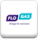
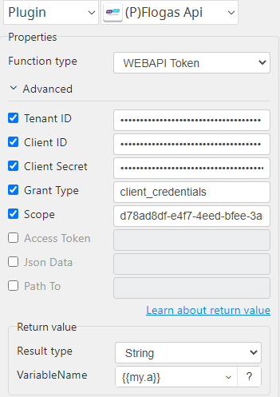
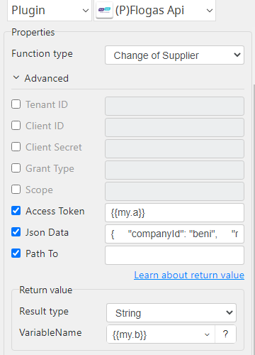

# Flogas Api

***Flogas Api with this plug-in manage api.***

## Flogas Api
| Item         |           Value            |
|--------------|:--------------------------:|
| Icon         |     |
| Display Name |       **Flogas Api**       |

### Arun Kumar (arunk@argos-labs.com)

Arun Kumar
* [Email](mailto:arunk@argos-labs.com) 
 
## Version Control 
* [6.0103.0210](setup.yaml)
* Release Date: `January 3, 2024`

## Input (Required)
| Operations         | Parameters    | Output      |
|--------------------|---------------|-------------|
| WEBAPI Token       | Tenant ID     | file_path   |
|                    | Client ID     |             |
|                    | Client Secret |             |
|                    | Grant Type    |             |
|                    | Scope         |             |
| Change of Supplier | Access Token  | file_path   |
|                    | Json Data     |             |

## Return Value

### Normal Case
Description of the output result

## Return Code
| Code | Meaning                      |
|------|------------------------------|
| 0    | Success                      |
| 1    | Exceptional case             |

## Output Format
You may choose one of 3 output formats below,

<ul>
  <li>String (default)</li>
  <li>CSV</li>
  <li>File</li>
</ul>  

## Parameter setting (diagrams)

## Operations

### WEBAPI Token:

### Change of Supplier:

